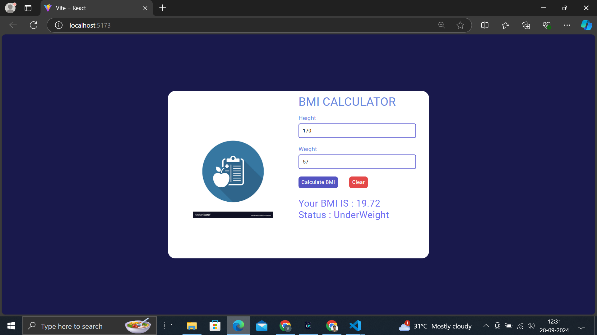

# BMI Calculator

# sample screen


## Table of Contents
- [Project Overview](#project-overview)
- [Technologies Used](#technologies-used)
- [Features](#features)
- [Installation](#installation)
- [Usage](#usage)
- [BMI Calculation](#bmi-calculation)


## Project Overview
The BMI Calculator is a simple web application that allows users to calculate their Body Mass Index (BMI) based on their height and weight. The application provides an easy-to-use interface for inputting these values and displays the calculated BMI along with its status (underweight, normal weight, overweight, or obese).

## Technologies Used
- **Frontend**:
  - JSX
  - CSS
  - HTML
- **Framework**: React

## Features
- User can input their **height** and **weight**.
- The application calculates the **BMI** value.
- Displays the **BMI status** (underweight, normal, overweight, or obese) based on the calculated value.
- Responsive design for better user experience on various devices.

## Installation
To run this project locally, follow these steps:

1. **Clone the repository**:
   ```bash
   git clone https://github.com/RVJVIJAY/BMI-Calculator/
2.**Navigate to the project directory:**

     cd bmi
3.**Install dependencies using npm or yarn:**

    npm install
4.**Start the development server:**

    npm run dev
5.**Open the app in your browser:**

    Once the development server is running, open http://localhost:5173 to view the application in your browser.

BMI Calculation
The Body Mass Index (BMI) is calculated using the formula:

BMI
=
weight (kg)
(
height (m)
)
2
BMI= 
(height (m)) 
2
 
weight (kg)
​
 

BMI Status:
Underweight: BMI < 18.5
Normal weight: 18.5 ≤ BMI < 24.9
Overweight: 25 ≤ BMI < 29.9
Obese: BMI ≥ 30
